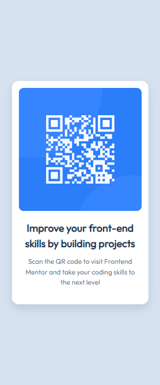

# Frontend Mentor - QR code component solution

This is a solution to the [QR code component challenge on Frontend Mentor](https://www.frontendmentor.io/challenges/qr-code-component-iux_sIO_H).  
Frontend Mentor challenges help you improve your coding skills by building realistic projects. 

## Table of contents

- [Frontend Mentor - QR code component solution](#frontend-mentor---qr-code-component-solution)
  - [Table of contents](#table-of-contents)
  - [Overview](#overview)
    - [Screenshot](#screenshot)
    - [Links](#links)
  - [My process](#my-process)
    - [Built with](#built-with)
    - [What I learned](#what-i-learned)
    - [Continued development](#continued-development)
    - [Useful resources](#useful-resources)
    - [Author](#author)
  - [Acknowledgments](#acknowledgments)

## Overview

### Screenshot



### Links

- Solution URL: [Add solution URL here](https://your-solution-url.com)
- Live Site URL: [Add live site URL here](https://your-live-site-url.com)

## My process

### Built with

- Semantic HTML5 markup
- CSS custom properties
- CSS Grid (for centering layout)
- `clamp()` for responsive typography and card width
- Mobile-first workflow

### What I learned
Working on this project reinforced the idea that small projects are great for practicing **clean structure and responsiveness**.  

I learned how powerful the `clamp()` function is for controlling font sizes and widths across different screen sizes without needing multiple media queries.  

Example:  

```css
.QR-code {
  max-width: clamp(320px, 25vw, 425px);
}

.QR-code h2 {
  font-size: clamp(1.25rem, 1rem + 1vw, 2rem);
}
```
### Continued development
In future projects I want to focus more on:

Using modern CSS features (min(), max(), clamp()) effectively

Practicing accessibility (better alt text, color contrast)

Improving workflow by setting up reusable component styles

### Useful resources
I referred to general HTML and CSS documentation, responsive design guides, and design principles, which helped me better understand modern CSS features, improve typography, and build a clean, responsive layout.

### Author
- Frontend Mentor - [@yourusername](https://www.frontendmentor.io/profile/saramx-dev)
- Twitter - [@yourusername](https://x.com/saramx_dev)
- LinkedIn - [@yourusername](https://www.linkedin.com/in/saramx-dev/)

## Acknowledgments
Thanks to the Frontend Mentor team and community for providing these challenges to practice real-world skills.